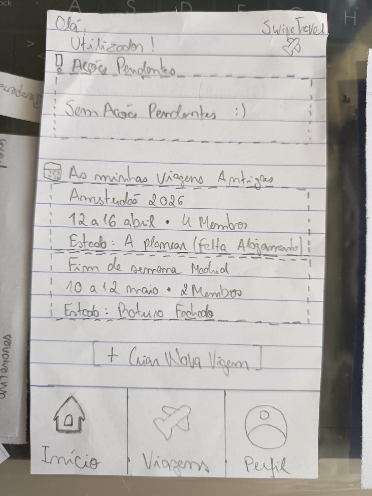
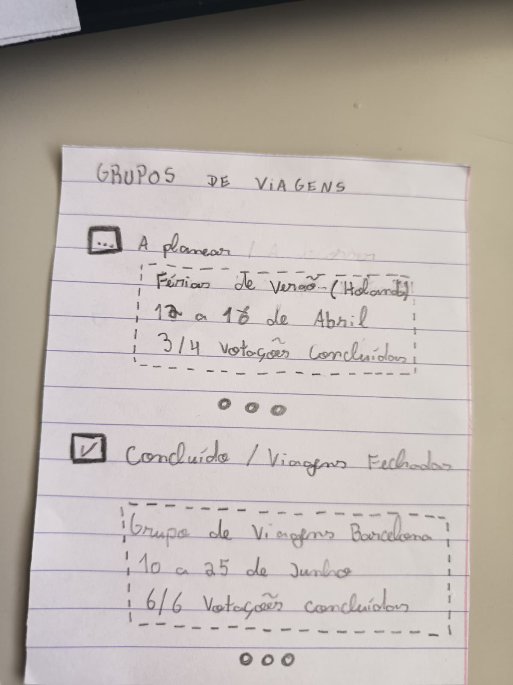
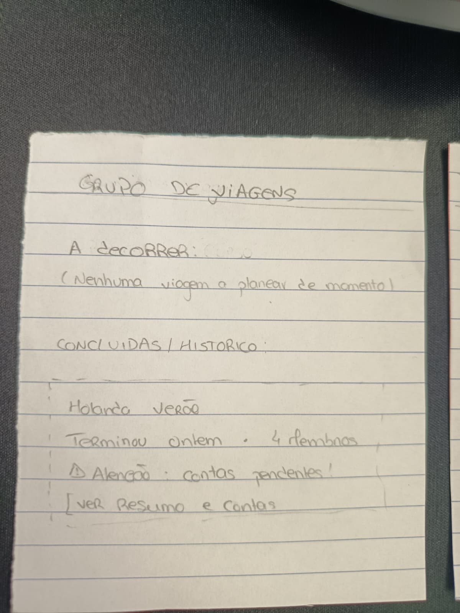
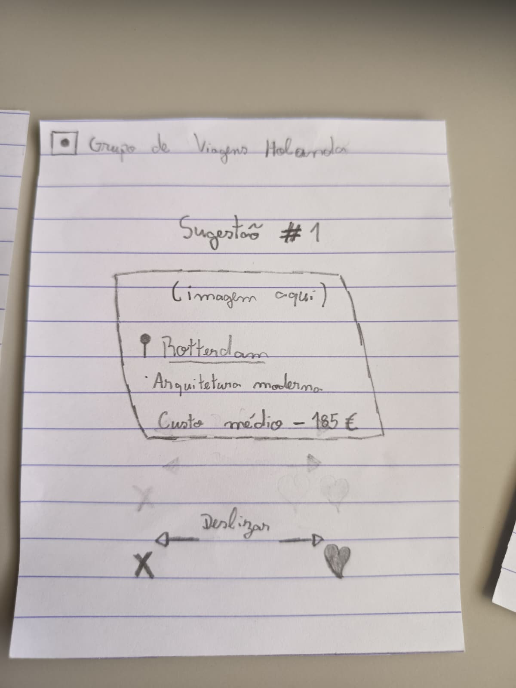

[Back to main Logbook Page](../hci_logbook.md)

---
# Low Fidelity Prototype and Evaluation

## D.1. Low Fidelity Prototype

O protótipo de baixa fidelidade foi criado para definir a estrutura inicial da plataforma e testar as principais interações antes da implementação final. Nesta fase, o objetivo não foi trabalhar o aspeto visual final, mas sim perceber se a navegação, a organização da informação e as funcionalidades principais faziam sentido para o utilizador.

O protótipo inclui os ecrãs principais da aplicação, como a página inicial, a secção de sugestões de férias, o formulário para adicionar uma nova sugestão e os cartões de sugestões com sistema de votação.

### Imagens do protótipo

As imagens seguintes mostram os alguns dos ecrãs do protótipo de baixa fidelidade:

  
  

  
  

### Principais funcionalidades representadas

O protótipo representa as seguintes funcionalidades:

- Visualização de sugestões de férias;
- Adição de uma nova sugestão;
- Associação de uma imagem a uma sugestão;
- Votação nas sugestões;
- Comparação entre sugestões através do título, descrição, imagem e número de votos.

### Decisões de design

Foi usada uma estrutura baseada em cartões para apresentar as sugestões, pois esta organização facilita a leitura e a comparação entre diferentes opções. Cada cartão contém a informação essencial da sugestão, incluindo título, descrição, imagem e votos.

A opção de adicionar sugestões foi incluída para reforçar o carácter colaborativo da plataforma, permitindo que os utilizadores contribuam com novas ideias para a viagem.

## D.2. Prototype Evaluation

O protótipo foi avaliado de forma informal, com o objetivo de identificar problemas de usabilidade antes de avançar para a implementação em HTML, CSS e JavaScript.

Durante a avaliação, foram consideradas tarefas como encontrar a secção de sugestões, adicionar uma nova sugestão, incluir uma imagem e votar numa sugestão existente.

### Principais resultados

A avaliação mostrou que o objetivo geral da plataforma era compreensível e que o sistema de sugestões e votação fazia sentido para os utilizadores.

No entanto, foram identificados alguns aspetos a melhorar:

- A opção para adicionar uma sugestão devia estar mais visível;
- As imagens precisavam de estar melhor organizadas dentro dos cartões;
- A imagem não devia sobrepor-se ao texto;
- Os botões de votação precisavam de feedback visual mais claro;
- O formulário para adicionar sugestões devia ter campos mais claros.

### Melhorias planeadas

Com base na avaliação, foram definidas as seguintes melhorias para a próxima versão:

- Tornar o botão de adicionar sugestão mais visível;
- Separar melhor a imagem e o texto nos cartões;
- Definir dimensões fixas para as imagens;
- Melhorar o feedback dos botões de votação;
- Tornar o formulário mais simples e claro.

### Conclusão

O protótipo de baixa fidelidade permitiu validar a ideia principal da plataforma e perceber que funcionalidades precisavam de ser melhoradas. A próxima fase será a implementação funcional do site, aplicando as alterações identificadas durante esta avaliação.

---
[Back to main Logbook Page](../hci_logbook.md)