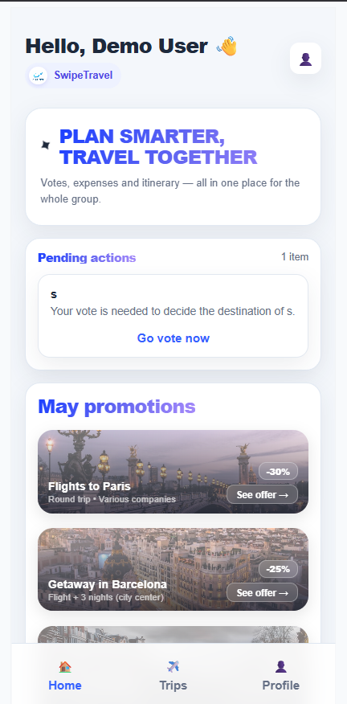
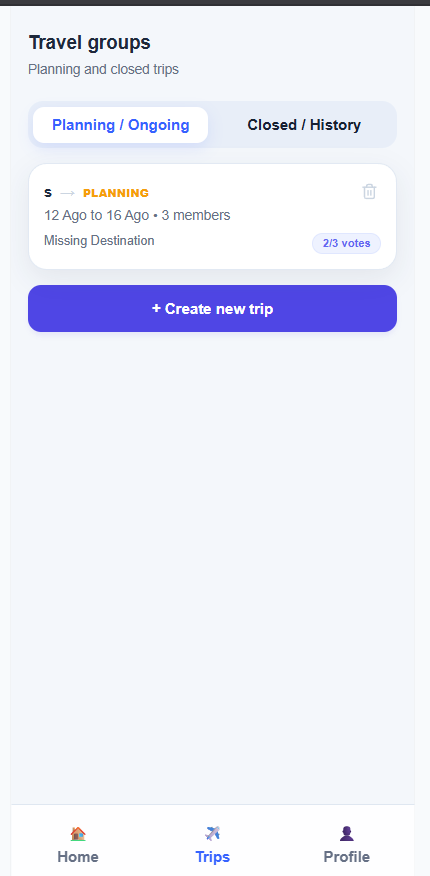
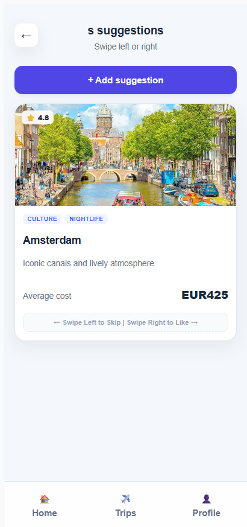
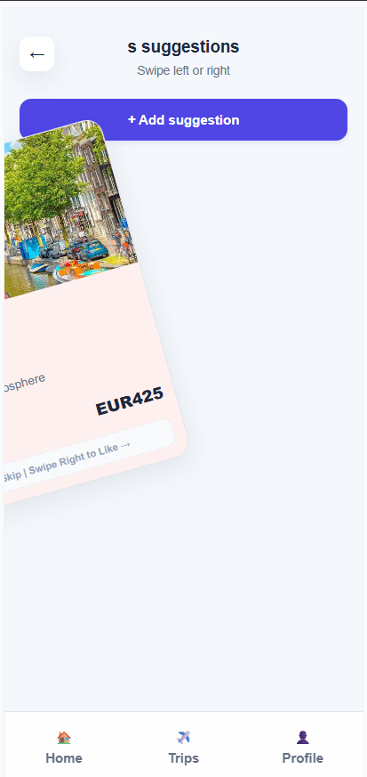
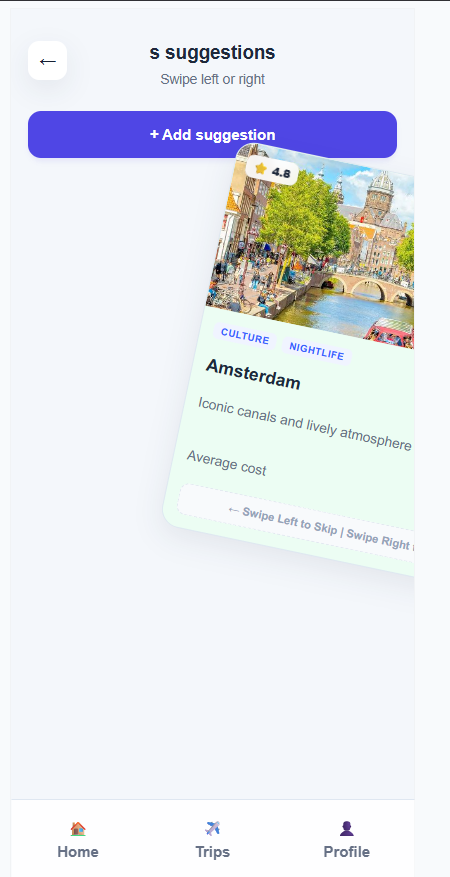

[Back to main Logbook Page](../hci_logbook.md)

---

# E. Functional Prototype and Evaluation

## E.1. Protótipo Funcional

O protótipo funcional foi desenvolvido usando HTML, CSS e JavaScript. Esta versão implementa as principais funcionalidades definidas no protótipo de baixa fidelidade e permite ao utilizador interagir com a plataforma de forma mais próxima da versão final.

O protótipo centra-se na ideia principal do projeto: ajudar um grupo a planear uma viagem em conjunto, através da criação de sugestões, votação em destinos e gestão de grupos de viagem.

As principais funcionalidades implementadas foram:

- Página inicial com ações pendentes e promoções;
- Página de grupos de viagem;
- Separação entre viagens em planeamento e viagens concluídas;
- Página de sugestões de destinos;
- Interação por swipe para gostar ou ignorar sugestões;
- Botão para adicionar uma nova sugestão;
- Cartões de sugestão com imagem, avaliação, etiquetas, descrição e custo médio;
- Barra de navegação inferior entre Home, Trips e Profile.

### Imagens do protótipo

As imagens seguintes mostram os alguns dos ecrãs do protótipo funcional.

  
  

  
  

  

### Implementação

O protótipo foi implementado com ficheiros separados de HTML, CSS e JavaScript. O HTML foi usado para definir a estrutura das páginas, o CSS para criar o layout visual e a interface responsiva, e o JavaScript para suportar elementos interativos, como os cartões de sugestões e o comportamento de swipe.

A interface foi pensada principalmente para dispositivos móveis, uma vez que a plataforma deve ser usada de forma rápida durante o planeamento de viagens em grupo. A barra de navegação inferior permite aceder às principais áreas da aplicação de forma simples e familiar.

## E.2. Avaliação com Utilizadores

O protótipo funcional foi avaliado de forma informal para perceber se os utilizadores conseguiam compreender e utilizar as principais funcionalidades da aplicação. A avaliação focou-se na navegação, na clareza da informação e na interação com os cartões de sugestões.

### Tarefas da avaliação

Durante a avaliação, os utilizadores foram convidados a realizar as seguintes tarefas:

1. Abrir a página inicial e identificar as ações pendentes.
2. Aceder à secção de viagens.
3. Abrir a página de sugestões de uma viagem em planeamento.
4. Visualizar uma sugestão de destino.
5. Usar a interação de swipe para gostar ou ignorar uma sugestão.
6. Encontrar o botão para adicionar uma nova sugestão.

### Principais resultados

A avaliação mostrou que os utilizadores compreenderam o objetivo geral da aplicação e conseguiram navegar entre as principais secções. O design baseado em cartões tornou as sugestões de destinos fáceis de ler e comparar.

A interação por swipe foi considerada intuitiva, principalmente por seguir padrões já conhecidos em aplicações móveis. A utilização de imagens nos cartões ajudou os utilizadores a identificar e compreender melhor cada destino.

No entanto, foram identificados alguns aspetos a melhorar:

- Algumas áreas de texto precisavam de melhor espaçamento;
- As instruções de swipe deviam estar mais visíveis;
- O botão para adicionar sugestões devia continuar sempre fácil de encontrar;
- O layout devia garantir que as imagens não se sobrepõem ao texto;
- Algumas etiquetas e textos podiam ser mais claros para utilizadores novos.

### Melhorias realizadas ou planeadas

Com base na avaliação, foram consideradas as seguintes melhorias:

- Melhorar o espaçamento entre imagens e texto;
- Definir tamanhos fixos para as imagens das sugestões;
- Tornar as instruções de swipe mais claras;
- Melhorar o feedback visual após gostar ou ignorar uma sugestão;
- Tornar o processo de adicionar uma sugestão mais direto;
- Melhorar a organização da página de grupos de viagem.

### Conclusão

O protótipo funcional implementa com sucesso a ideia principal do projeto e permite ao utilizador interagir com as funcionalidades essenciais da plataforma. A avaliação confirmou que a aplicação é compreensível e utilizável, mas também ajudou a identificar pequenos ajustes de interface que podem melhorar a experiência do utilizador em futuras iterações.

---

[Back to main Logbook Page](../hci_logbook.md)

---